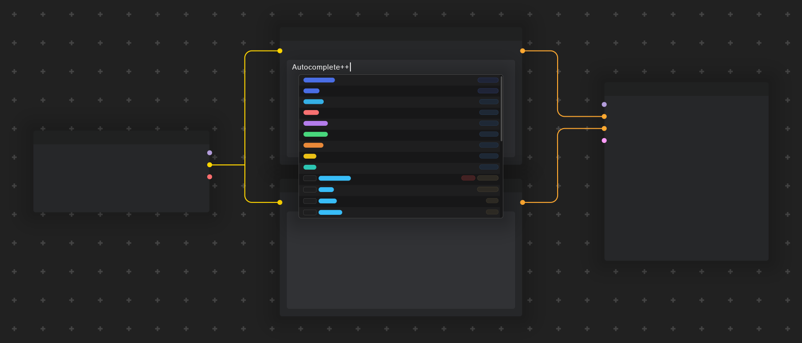
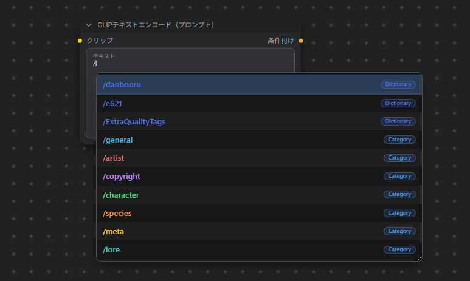
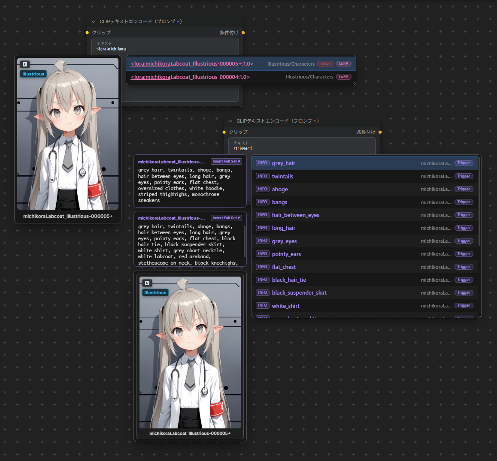
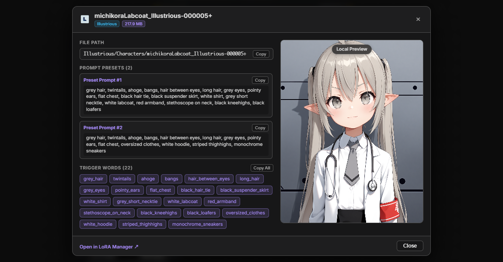

<div align="center">

# Autocomplete++



## English · [日本語](README_jp.md)

Tag autocomplete, prompt formatting, and dynamic prompt expansion extension for [ComfyUI](https://github.com/comfyanonymous/ComfyUI).

[Features](#features) · [Installation](#installation) · [Shortcuts](#keyboard-shortcuts-reference) · [Syntax Examples](#syntax-examples) · [Custom Dictionaries and Wildcards](#custom-dictionaries-and-wildcards) · [Settings Reference](#settings-reference) · [About the Project](#about-the-project) · [Acknowledgments](#acknowledgments) · [License](#license)



</div>

## Overview

**Autocomplete++** provides tag autocomplete, LoRA/embedding suggestions, dynamic prompt and wildcard expansion, auto-formatting, and editing shortcuts for text inputs in ComfyUI. It supports both ComfyUI Node 2.0 and the classic LiteGraph UI.

This project is built upon and refactored from [ComfyUI-Autocomplete-Plus](https://github.com/newtextdoc1111/ComfyUI-Autocomplete-Plus) by [newtextdoc1111](https://github.com/newtextdoc1111).

---

## Installation

### ComfyUI-Manager

Search for `Autocomplete++` in [ComfyUI-Manager](https://github.com/Comfy-Org/ComfyUI-Manager), install the custom node that appears, and restart.

### Manual

Clone or copy this repository into the `custom_nodes` folder of ComfyUI.
`git clone https://github.com/michikora/ComfyUI-Autocomplete-Plus-Plus.git`

---

## Features

### 1. Tag Autocomplete

- **Tag, Alias & Translation Search**: Search across Danbooru and e621 tags, aliases, and translations in real time.
- **Category Colors**: Follows Danbooru color conventions (General, Artist, Copyright, Character, Meta).
- **Special Prefix Completions**:
    - `<lora:` &rarr; Lists imported LoRAs with subfolder navigation and preview thumbnails.
    - `embedding:` / `emb:` &rarr; Lists imported Textual Inversion embeddings.
    - `__` &rarr; Navigates wildcard files and folders. Entering a path with a trailing slash (e.g. `__folder/file/`) lists the file's individual lines for direct selection.
    - `@` &rarr; Supports searching and inserting dedicated artist syntax when using Anima models. (When Anima Mode is active, selecting artist tags from regular searches will also automatically prepend `@`.)
    - `/artist`, `/character`, `/copyright`, `/general`, `/meta`, `/danbooru`, `/e621` &rarr; Filters search results by category or dictionary. Supports multi-tier slash chaining (e.g. `/danbooru /artist query` or `/danbooru artist query`).
- **Wiki Links**: Press `F1` or click the `WIKI` button next to Danbooru/e621 tags to open their wiki page.
- **LoRA Manager Integration (Trigger Words & LoRA Details View)**:
  When [ComfyUI-Lora-Manager](https://github.com/willmiao/ComfyUI-Lora-Manager) is available, Autocomplete++ links with it to provide:
    - `<trigger:` &rarr; Lists trigger words for all LoRAs currently loaded in the active workflow. Hovering/selecting shows preview cards and compound prompt preset cards. Clicking **"Insert Full Set ↵"** on a preset card inserts the complete prompt preset directly.
    - **LoRA Details View**: Press `F1` or click the `INFO` button on a trigger word suggestion to open the dedicated LoRA details view (if multiple active LoRAs share a trigger word, a LoRA selector menu appears first; press number keys `1`–`9` to open local details, or `Ctrl + 1`–`9` to open external pages):
        - **Basic Information**: Displays filename, file path (with copy button), base model, version, file size, and external links (Civitai / Hugging Face).
        - **Usage Parameters & Notes**: Shows user notes, as well as recommended strength, clip settings, and model descriptions if configured or cached in LoRA Manager.
        - **Trigger Words & Presets**: Displays trigger word chips (click to copy individual tags, or click "Copy All") and compound prompt presets with one-click copy buttons.
        - **Showcase Gallery & Metadata**: Browse local preview and remote showcase images (using `Left` / `Right` arrow keys or thumbnail strip). Click any image to display the **Generation Metadata** overlay (prompt, negative prompt, sampler, seed, steps, CFG, etc.) with copy buttons.
        - **Open in LoRA Manager**: Direct footer link to locate the LoRA in LoRA Manager.

<div align="center">




</div>

---

### 2. Dynamic Prompts & Wildcards

- **Seed-Linked, Sequential & Fixed Last Choice Modes**:
    - **Follow Seed**: Dynamic prompt choices and wildcard sampling can follow the generation seed to maintain reproducible generation results.
    - **Keep Last Choice**: Reuses the exact choices sampled from the previous generation as long as the KSampler master seed remains unchanged. This allows you to lock in a desired random combination while fine-tuning prompts or running multi-pass workflows (e.g. Hires.fix, ADetailer).
    - **Sequential**: Cycles through wildcard lines in sequential order across successive generation runs.
    - **Restore Choices on PNG Import (Experimental)**: When importing or dropping a generated PNG into ComfyUI while **Keep Last Choice** is active, Autocomplete++ automatically recovers the exact dynamic prompt choices and wildcard selections from that image. As long as the master seed remains unchanged, subsequent generations will reuse the restored choices instead of re-rolling.
        - _Note_: Only dynamic prompt choices and locally installed wildcard items can be restored. Workflows loaded from `.json` files or PNGs without embedded prompt metadata are not supported. Additionally, due to differences in hardware and runtime environments, full reproducibility of generated images cannot be guaranteed across different systems.
- **Multi-Pass Consistency**: Ensures Pass 1, Hires.fix, and ADetailer/FaceDetailer passes receive identical sampled choices within the same generation run.
- **Supported Syntax**:
    - **Choices**: `{red hair | blue hair | green hair}` &rarr; Randomly picks 1 option (e.g. `red hair`)
    - **Weighted Choices**: `{3::sunny, outdoors | 1::rainy, indoors}` &rarr; Picks with 3:1 probability ratio (75% chance for `sunny, outdoors`)
    - **Combinations**: `{2$$red | blue | green}` &rarr; Picks 2 distinct items joined by comma (e.g. `red, green`)
    - **Custom Separators**: `{1-3$$ and $$apples | bananas | oranges}` &rarr; Picks 1 to 3 items joined by custom separator (e.g. `apples and oranges`)
    - **Wildcards**: `__clothing/dresses__` &rarr; Expands a line from the wildcard file (can also be nested inside dynamic prompt choices; supports `.txt`)
    - **Literal Escaping**: `\{`, `\}`, and `\__` &rarr; Escapes braces and double underscores to output literal characters without triggering expansion.
    - **Safe Preservation**: Non-choice braces (such as JSON structures `{"key": "value"}` or single tokens without `|` or `$$`) are preserved as literals.

---

### 3. Keyboard Shortcuts & Prompt Editing

- **Tag & LoRA Weight Adjustment (`Ctrl + Up / Down`)**:
    - **Multi-Word & Unweighted Tags**: Automatically detects the full tag boundaries under the cursor (e.g. `long hair` &rarr; `(long hair:1.05)`) instead of splitting words into `long (hair:1.05)`. If text is selected, the adjustment applies directly to the entire selection.
    - **Parenthesized & Embedding Weights**: Increments (`Ctrl + Up`) or decrements (`Ctrl + Down`) existing weights by the configured step. Fully supports tags with `embedding:` or `emb:` prefixes (e.g. `(embedding:easynegative:1.05)`). Automatically removes outer parentheses when the weight returns to `1.0` (e.g. `(1girl:1.05)` &rarr; `1girl`).
    - **LoRA Weights**: Supports `<lora:name>`, `<lora:name:1.0>`, `<lyco:name:1.0>`, and `<name:1.0>` formats. Automatically appends a weight if not present (e.g. `<lora:my_model>` &rarr; `<lora:my_model:1.05>`) and increments/decrements values by the configured LoRA step.
    - **Configurable Steps**: Separate step sliders (0.05–0.50) are available in **Settings &rarr; Autocomplete** for tags and embeddings (`Tag / Embedding Weight Step`) and LoRAs (`LoRA Weight Step`).
- **Tag-by-Tag Cursor Navigation (`Ctrl + Left / Right`)**:
    - Jumps the cursor across tag ends (landing right before commas, pipes, or brackets).
    - Navigates through individual options inside `{a|b|c}` choices.
- **Tag Swapping / Reordering (`Alt + Left / Right`)**:
    - Swaps the current tag with its left or right neighbor while keeping cursor focus on the moved tag.
    - Confines reordering inside `{a|b|c}` options without leaking outside.
    - Jumps over `{a|b|c}`, `<lora:...>`, and `__wildcard__` blocks as single units.

---

### 4. Prompt Auto-Formatter

- **Trigger**: Automatically formats prompt text when the textarea loses focus.
- **Formatting Rules**:
    - Normalizes spacing after commas (`1girl,solo` &rarr; `1girl, solo`).
    - Collapses duplicate commas (`1girl,, solo` &rarr; `1girl, solo`).
    - Trims trailing comma at prompt end, with an optional toggle to also trim trailing commas at line ends.
    - Converts underscores to spaces for regular tags (`blue_hair` &rarr; `blue hair`).
- **Exclusions & Protection**:
    - Preserves emoticons and kaomojis (e.g. `^_^`, `>_<`, `-_-`, `|_|`, `o_o;`, `ಠ_ಠ`, `ಥ_ಥ`, `<|>_<|>`).
    - Preserves `<lora:...>`, `embedding:...`, `__wildcard__` syntax.
    - Keep Underscores Configuration: Specify tags in **Settings &rarr; Formatting &rarr; Keep Underscores for Tags** (e.g. `custom_tag`, `special_style`) to exempt them from space replacement and preserve literal underscores.
    - Formats sub-tags inside `{a|b|c}` options without breaking choice syntax.

---

### 5. Tag Usage History & Favorites

- **Favorite Tags**: Tracks tag usage frequency to prioritize frequently used tags in suggestions (displayed with a `Favor` badge).
- **Settings Controls**: Max stored favorites can be adjusted, auto-aged, or cleared directly from settings.

---

### 6. Node Compatibility & Integrations

- **Canvas Right-Click Context Menu**: Right-clicking any text-capable node on the canvas opens the `Autocomplete++` submenu:
    - **Instance-Level Toggles**: `Disable for this node` / `Enable for this node` toggles autocomplete on that specific node instance without modifying global settings. `Reset to default for this node` restores the node to follow global settings.
    - **Node Type Global Toggles**: `Ignore this node type` / `Unignore this node type` (disables Autocomplete++ globally for that node class) and `Force override this node type` / `Remove override for this node type` (prioritizes Autocomplete++ over conflicting built-in popups).
    - **Native Note Node Handling**: Native ComfyUI `Note` nodes are excluded by default to keep canvas notes unaffected, but can be enabled for individual notes via the context menu.
- **LoRA Path Completion Mode**: Configure whether LoRA completions insert clean filenames or full relative paths via **Settings &rarr; Models & Integrations &rarr; LoRA Path Completion Mode** (`Auto`, `Filename Only`, `Full Path`). In `Auto` mode, clean filenames are used by default, with automatic fallback to relative paths if duplicate LoRA names exist across subfolders, aligning with LoRA Manager path settings if active.
- **LoRA / Embedding & External Integrations**: Supports LoRA/Embedding completions and thumbnail previews. Integrates with LoRA Manager for automatic trigger word sniffing, fallback previews, and the LoRA details view.
- **Anima Model Compatibility**: Automatically detects Anima models by default to prepend artist tags with `@`, with manual override options (`Auto`, `Enabled`, `Disabled`) under **Settings &rarr; Formatting &rarr; Anima Artist '@' Prefix Mode**.

---

### 7. Standalone Canvas Controller Nodes

Autocomplete++ provides 4 optional standalone controller nodes located under the **`Autocomplete++`** node category.

**No wiring required**: Place them anywhere on your canvas to override global settings for the current workflow without modifying your global preferences. Options left on **Default (From Settings)** automatically inherit global settings.

**Optional Passthrough Slot**: All controller nodes include an optional `passthrough` input/output slot. While no wiring is required for settings to take effect, you can optionally insert the controller inline into any existing connection (MODEL, CLIP, IMAGE, PIPE, etc.) to pass data straight through unmodified for workflow organization.

- **`Autocomplete++ Wildcard & Dynamic Controller`**:
    - Overrides Prompt Expansion Engine (`Enabled` / `Disabled`), Wildcard Mode (`Random` / `Follow Seed` / `Keep Last Choice` / `Sequential`), and Dynamic Prompt Mode (`Random` / `Follow Seed` / `Keep Last Choice`).
- **`Autocomplete++ Formatting Controller`**:
    - Overrides auto-format on blur, comma spacing, trailing comma trimming, underscore-to-space replacement, parenthesis escaping, auto-insert comma, Anima artist mode (`@`), and provides custom Keep Underscores tag entries (`Append to Global List` or `Override Global List`).
- **`Autocomplete++ Integrations Controller`**:
    - Overrides LoRA & Embedding suggestion availability, LoRA path completion mode, and LoRA Manager trigger word / preview integration behavior.
- **`Autocomplete++ Dictionaries Controller`**:
    - Overrides the primary tag dictionary, translation dictionary, and extra tag dictionaries. Features a dedicated standalone CSV dictionary picker with autocompletion.

#### Multi-Node Arbitration & Priority Logic

- **Mute / Bypass Awareness**: Nodes that are muted (`Ctrl + M`) or bypassed (`Ctrl + B`) automatically yield control, allowing multiple preset controllers to be toggled via Mute or Bypass without removing nodes.
- **Last-Interacted Priority**: When multiple active controllers of the same type coexist on canvas, modifying any setting on a controller gives it precedence.
- **Newest Node ID Fallback**: If no interaction history exists, the node with the highest ID (newest created) automatically takes precedence.

#### Visual Status Badges

- **Single Controller Behavior**: When only one controller of a given type exists on the canvas, no badge is displayed to keep the interface clean.
- **Multiple Controllers Display**: When multiple controllers of the same type exist on canvas:
    - The currently active controller displays an **`Active`** pill badge in its bottom bar.
    - Overridden duplicate controllers display an **`Inactive`** pill badge with a tooltip showing which node is in control. Clicking the **`Inactive`** badge switches control to that node.
- **UI Compatibility Note**: The visual status badge is currently supported on Node 2.0. The priority arbitration and Mute/Bypass logic itself functions identically on legacy frontends, though the visual badge is not rendered in the legacy UI.

---

## Keyboard Shortcuts Reference

| Shortcut                             | Context                                    | Action                                                  |
| :----------------------------------- | :----------------------------------------- | :------------------------------------------------------ |
| **`Tab`** / **`Enter`**              | Autocomplete popup open                    | Insert selected suggestion                              |
| **`Up`** / **`Down`**                | Autocomplete popup open                    | Navigate suggestions                                    |
| **`PageUp`** / **`PageDown`**        | Autocomplete popup open                    | Jump up / down by 5 suggestions                         |
| **`Esc`** / **`Left`** / **`Right`** | Autocomplete popup open                    | Close active suggestion popup                           |
| **`F1`**                             | Danbooru/e621 tag or trigger word selected | Open Danbooru/e621 Wiki, or open LoRA details / Civitai |
| **`1` – `9`**                        | Trigger word LoRA selector menu open       | Open local LoRA details for corresponding LoRA          |
| **`Ctrl + 1` – `9`**                 | Trigger word LoRA selector menu open       | Open Civitai / HF page for corresponding LoRA           |
| **`Left` / `Right`**                 | LoRA details view open                     | Navigate showcase images in gallery                     |
| **`Esc`**                            | LoRA details view open                     | Close metadata overlay or LoRA details view             |
| **`Ctrl + Up / Down`**               | Textarea                                   | Adjust weight of tag, embedding, or LoRA at cursor      |
| **`Ctrl + Left / Right`**            | Textarea                                   | Jump cursor across tag ends                             |
| **`Alt + Left / Right`**             | Textarea                                   | Swap tag with neighbor                                  |

---

## Syntax Examples

### Standard Tags & Weights

```text
masterpiece, 1girl, solo, long hair, (blue eyes:1.2), (smile:0.9)
```

### Anima Artist Tags

```text
masterpiece, 1girl, @artist_name1, @artist_name2
```

### LoRAs & Embeddings

```text
<lora:anime_style_v2:0.8>, (embedding:easynegative:1.1)
```

### Wildcards

```text
__backgrounds/scenery__, __clothing/dresses__
```

### Dynamic Prompts

```text
{day | sunset | night}
{3::outdoors, sunny | 1::indoors, room}
{2$$red ribbons | blue ribbons | green hairband | flower hairclip}
{1-3$$ and $$masterpiece | best quality | highres}
```

---

## Custom Dictionaries and Wildcards

> This extension only includes basic dictionaries csv files. To use features like tag translations or wildcards, please prepare the corresponding `.csv` or `.txt` files and place them into the respective directories described below.

### Custom Tag CSV Files

Place custom CSV files in the `tags/` directory:

```csv
tag,category,count,aliases
masterpiece,5,9999999,"master piece,best"
```

Select extra tag files in **ComfyUI Settings &rarr; Autocomplete++ &rarr; Tags & Dictionaries &rarr; Extra Tag Files**.

### Translation CSV Files

To enable translated tag searching and display, place 2-column or 3-column CSV files into `tags/translations/`:

```csv
tag,translation
1girl,女の子
long_hair,ロングヘア
```

Then select your translation file in **ComfyUI Settings &rarr; Autocomplete++ &rarr; Translation &rarr; Translation File**.

### Wildcard Files

Place `.txt` files in any of these locations:

- `ComfyUI-Autocomplete-Plus-Plus/wildcards/`
- `ComfyUI/wildcards/`
- Any custom node wildcards folder (e.g. `ComfyUI/custom_nodes/*/wildcards/`)

---

## Settings Reference

Access settings via the ComfyUI Settings Dialog under **Autocomplete++**:

1. **Autocomplete**:
    - `Enable Autocomplete`: Toggle tag completion on/off.
    - `LoRA Weight Step`: Configures the weight adjustment step for LoRAs when pressing `Ctrl + Up / Down` (slider from 0.05 to 0.50, default: 0.05).
    - `Tag / Embedding Weight Step`: Configures the weight adjustment step for standard tags and embeddings when pressing `Ctrl + Up / Down` (slider from 0.05 to 0.50, default: 0.05).
    - `Insert Suggestion with`: Select `Tab` and/or `Enter` to insert suggestions.
    - `Ignore Nodes`: Specify node types or keywords (comma-separated) where Autocomplete++ is disabled.
    - `Override Nodes`: Specify node types or keywords (comma-separated) to prioritize Autocomplete++ on.
    - `Enable Console Debug Logs`: Outputs debug logs to the browser console.
2. **Display**:
    - `Floating Preview Card Position`: Position of LoRA/Embedding thumbnails (`Left`, `Right`, `Disabled`).
    - `Max Suggestions Count`: Number of suggestions shown in the dropdown list (default: 15).
    - `Show Wiki Badge`: Displays the clickable `WIKI` button next to tags with wiki entries (currently supports Danbooru and e621 dictionaries; CSV filename must contain "danbooru" or "e621").
    - `Prioritize Frequently Used Tags (Favor)`: Boosts frequently used tags in suggestions with a `Favor` badge.
    - `Favor Threshold / Validity / Capacity`: Configure min usage count, validity days, and storage capacity for favorites.
    - `Clear Favor History`: Clears stored tag usage history.
3. **Formatting**:
    - `Anima Artist '@' Prefix Mode`: Controls `@` artist prefix handling (`Auto`, `Enabled`, `Disabled`).
    - `Auto-Insert Comma`: Automatically appends a comma and space after inserting a tag.
    - `Replace Underscore with Space`: Replaces underscores with spaces on tag insertion.
    - `Escape Parentheses`: Automatically escapes literal parentheses (e.g. `tag (qualifier)` &rarr; `tag \(qualifier\)`).
    - `Auto Format on Blur`: Formats prompt text when textarea loses focus.
    - `Auto Format Rules`: Individual toggles for space after comma, trim prompt end comma, trim line end comma, and replace underscores with spaces.
    - `Keep Underscores for Tags`: Specify tags (comma-separated) to exempt from underscore replacement and preserve literal underscores.
4. **Models & Integrations**:
    - `Enable LoRAs and Embeddings`: Toggle `<lora:` and `embedding:` completions on/off.
    - `LoRA Path Completion Mode`: Controls whether LoRA suggestions insert clean filenames or full relative paths (`Auto`, `Filename Only`, `Full Path`).
    - `LoRA Manager Integration`: Controls LoRA Manager API trigger words sniffing, fallback previews, and LoRA details view integration (`Auto`, `Enabled`, `Disabled`).
5. **Shortcuts & Interaction**:
    - `Enable Hotkey Enhance`: Master switch for prompt editing shortcuts.
    - `Hotkey Rules`: Individual toggles for Full-Tag Weight Adjustment (`Ctrl+Up/Down`), Tag Navigation (`Ctrl+Left/Right`), and Tag Swapping (`Alt+Left/Right`).
6. **Tags & Dictionaries**:
    - `Main Tag File`: Primary tag CSV file loaded from `tags/`.
    - `Extra Tag Files`: Multi-select dropdown for loading additional tag CSV dictionaries.
    - `Translation File`: Selects translation CSV file loaded from `tags/translations/`.
7. **Translation**:
    - `Search by Translation`: Allows searching tags by their translated names.
    - `Show Translations in Suggestions`: Displays translated names next to English tags in suggestions.
    - `Old 3-column format`: Compatibility toggle for legacy 3-column translation CSVs.
8. **Wildcards & Dynamic Prompts**:
    - `Enable Prompt Expansion Engine`: Toggle prompt expansion engine on/off.
    - `Wildcards Mode`: Controls wildcard sampling behavior (`Random`, `Follow Seed`, `Keep Last Choice`, `Sequential`).
    - `Dynamic Prompts Mode`: Controls dynamic prompt choices behavior (`Random`, `Follow Seed`, `Keep Last Choice`).

---

## About the Project

This is a personal hobby project developed in my spare time. Because of limited time and maintenance capacity:

- **Issues**: Responses and bug fix updates might be slow. Thank you in advance for your patience and understanding!
- **Pull Requests**: I currently do not have enough time or capacity to properly review and test external code, so Pull Requests are not accepted at this time. My sincere apologies for the inconvenience.
- **Forks & Custom Versions**: You are warmly welcome to fork the repository and create your own customized versions under the [MIT License](LICENSE).
- **Documentation**: This README was compiled with AI assistance based on the codebase and manually reviewed, but may still contain inadvertent omissions or errors.

---

## Acknowledgments

- **[ComfyUI-Autocomplete-Plus](https://github.com/newtextdoc1111/ComfyUI-Autocomplete-Plus)** by [newtextdoc1111](https://github.com/newtextdoc1111) – The original extension from which Autocomplete++ was derived and refactored.
- **[a1111-sd-webui-tagcomplete](https://github.com/DominikDoom/a1111-sd-webui-tagcomplete)** by [DominikDoom](https://github.com/DominikDoom) – Inspiration and reference for various features and concepts.

---

## License

This project is licensed under the [MIT License](LICENSE).
